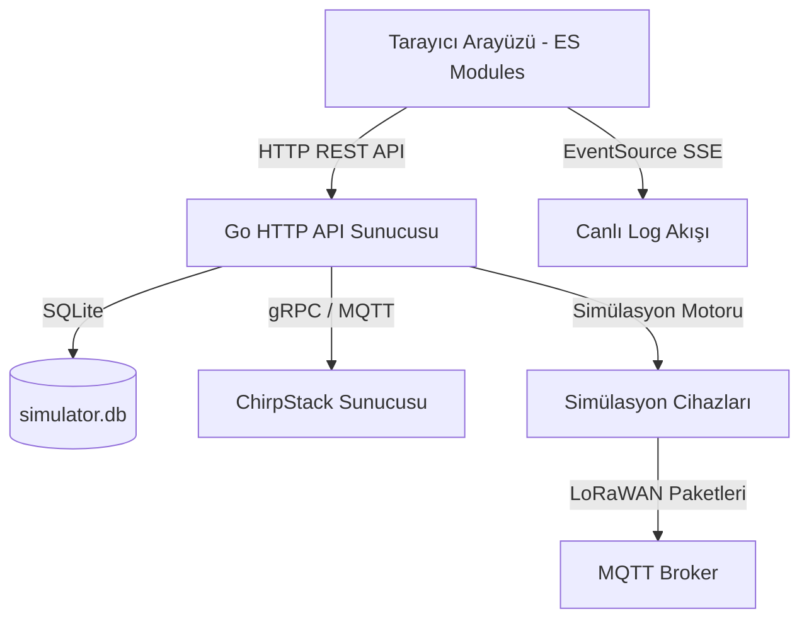

# ChirpStack Simulator Mimari Rehberi (ARCHITECTURE.md)

Bu rehber, ChirpStack Simülatörü projesinin modern ve modüler yazılım mimarisini, dizin yapısını ve veri akışlarını belgelemektedir.

---

## 🏗️ Genel Mimari Şeması

Proje, istemci tarafında modern tarayıcıların yerel olarak desteklediği **ES Modules (JavaScript)** mimarisini, sunucu tarafında ise **Go (Golang)** dilinde yazılmış HTTP API ve LoRaWAN simülasyon motorunu kullanır.

---

## 📂 Dizin ve Dosya Yapısı

### 1. Ön Yüz (Frontend) Dizin Yapısı (`internal/api/frontend/`)
Ön yüz kodları tek sorumluluk prensibine (SRP) uygun olarak yapılandırılmıştır:

*   **`index.html`:** Derlenmiş ana HTML arayüz dosyası.
*   **`style.css`:** Arayüz tasarım stilleri, renk temaları ve animasyonlar.
*   **`build.py`:** `src/` dizini altındaki HTML şablonlarını birleştirerek `index.html` dosyasını derleyen betik.
*   **`src/`:** Arayüz bileşenlerinin ham HTML şablonları.
*   **`js/`:** ES Modül kaynak dosyaları:
    *   **`main.js`:** Uygulamanın giriş noktası (bootstrap). DOM hazır olduğunda olay dinleyicilerini bağlar ve sekmeleri başlatır.
    *   **`state.js`:** Simülasyonun ön yüzdeki anlık durumunu (organizasyonlar, aktif sekme, harita nesnesi vb.) tutan reaktif olmayan durum yöneticisi.
    *   **`utils.js`:** Ortak DOM seçiciler (`$`, `$$`), bildirimler (toast/logger), çekmece (drawer) kontrolleri ve renk teması algoritmaları.
    *   **`api.js`:** Sunucuya giden istekleri sarmalayan ve 401 yetkisiz erişim durumunda kullanıcıyı login ekranına yönlendiren fetch istemcisi.
    *   **`translate.js`:** Türkçe ve İngilizce dil sözlüklerini barındıran ve DOM elemanlarını dinamik çeviren dil yöneticisi.
    *   **`tabs/`:** Her sekme için izole edilmiş iş mantıkları:
        *   `dashboard.js`: Simülasyon kontrolleri, Leaflet canlı harita entegrasyonu ve Chart.js grafik çizimleri.
        *   `orgs.js`: Organizasyon listesi, SQLite üzerinde simülasyon ayarlarını kaydetme mantığı.
        *   `networks.js` & `devices.js` & `device-list.js`: LoRaWAN uygulama, profil ve cihaz tabloları, arama ve filtreleme.
        *   `device-status.js`: Çalışan simülasyon cihazlarının anlık durum takibi.
        *   `settings.js` & `console.js`: Bağlantı ayarları, JS transform betikleri ve SSE üzerinden akan konsol logları.
        *   `system-logs.js`: Log Merkezi (Log Center) arayüz yönetimi, IndexedDB kalıcılığı, arama/filtreleme, export ve otomatik pazartesi temizliği iş mantıkları.
    *   **`wizards/`:** Çok adımlı sihirbaz modalları (Bootstrap, Cihaz Profili ve Uygulama ekleme akışları).

### 2. Arka Yüz (Backend) Dizin Yapısı (`internal/api/` & `simulator/`)
Backend tarafı, sunucu yönetimini ve iş mantıklarını modüler Go dosyalarında saklar:

*   **`internal/api/`:** HTTP sunucusu ve API handlers:
    *   **`server.go`:** Sunucu başlatma (`New`, `Start`, `Stop`), HTTP yönlendirici (mux) rotaları, health check ve JSON yanıt yardımcıları.
    *   **`simulation.go`:** Simülasyon başlatma, durdurma, durum sorgulama, ChirpStack tenant eşitlemesi ve simülasyon metrik API işleyicileri.
    *   **`auth.go`:** Oturum açma (login/logout), JWT tabanlı oturum denetimi ve `requireAuth` koruma ara yazılımı (middleware).
    *   **`database.go`:** SQLite bağlantısı, tablo oluşturma şemaları ve CRUD veritabanı işlemleri (simülatör ayarları SQLite veritabanında saklanır).
    *   **`organizations.go` & `applications.go` & `devices.go` & `device_profiles.go`:** ChirpStack gRPC/REST API'si ile haberleşerek LoRaWAN kaynaklarını yöneten handlers.
    *   **`logs.go`:** Sunucudaki logları tarayıcıya EventSource (SSE) üzerinden gerçek zamanlı aktaran log akış işleyicisi.
*   **`simulator/`:** LoRaWAN simülasyon motoru:
    *   **`device.go`:** Simüle edilen her bir LoRaWAN cihazının join süreçlerini, MQTT üzerinden veri gönderme döngülerini ve spreading factor hesaplamalarını yürüten kodlar.

---

## 🔄 Veri Akışı ve Haberleşme Protokolleri

1.  **Yetkilendirme:** Kullanıcı oturum açtığında sunucu HTTPOnly bir `sim_session` cookie'si ayarlar. Tüm korumalı `/api/*` istekleri `requireAuth` ara yazılımından geçmek zorundadır.
2.  **Canlı Log Akışı:** Simülasyon başladığında ön yüz `/api/logs/stream` adresine bir `EventSource` (Server-Sent Events) bağlantısı açar. Sunucu, simülasyon motorunun ürettiği logları ve ChirpStack MQTT broker'dan yakalanan downlink paketlerini bu akış üzerinden tarayıcıya anlık olarak yazar.
3.  **Harita ve Grafik Güncellemeleri:** Sunucunun `/api/status` rotası her 2 saniyede bir sorgulanarak (polling) simülasyonun durumu kontrol edilir. Gelen anlık metrikler doğrultusunda Leaflet haritası üzerindeki cihazlar tetiklenir ve performans grafiği güncellenir.

---

## 🧪 Kalite ve Test Politikası

*   **Birim Testleri:** Backend birim testleri `go test ./...` komutuyla çalıştırılır ve veritabanı ile API bileşenlerinin doğruluğunu denetler.
*   **E2E Testleri:** Arayüzün tüm akışları (login, tab geçişleri, ayar limitleri ve kurulum sihirbazları) Playwright otomasyon aracı ile `tests/e2e/` dizini altında test edilir. `python tests/e2e/run_e2e.py` komutuyla E2E testleri tetiklenir.
