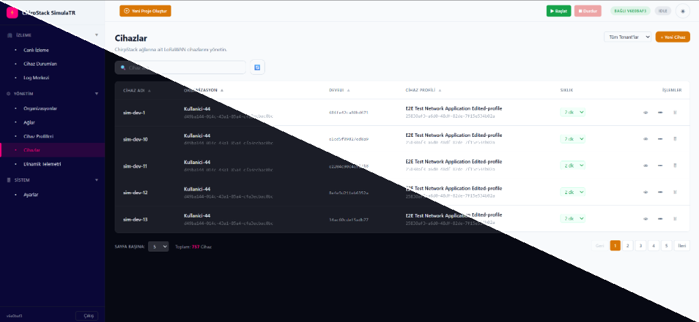
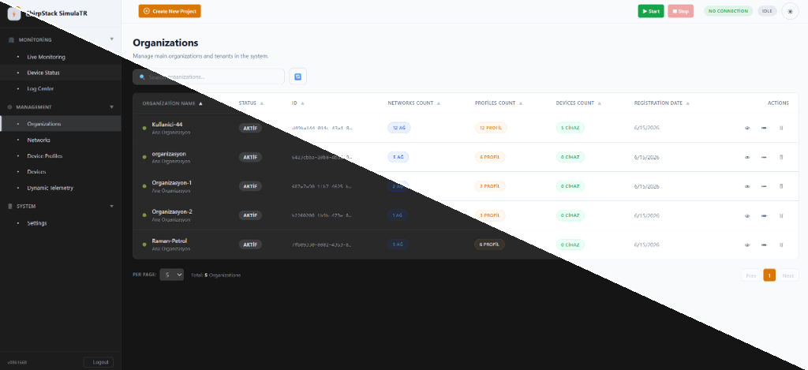

# ChirpStack Simulator

ChirpStack Simulator is a powerful, feature-rich simulator designed for the [ChirpStack](https://www.chirpstack.io) open-source LoRaWAN<sup>&reg;</sup> Network-Server (v4). It simulates a configurable number of devices and gateways, which are automatically registered, configured, and cleaned up. It features a modern, responsive Web UI to monitor and control simulations in real-time.

This project was developed in collaboration with [TWTG](https://www.twtg.io/).

## Web UI Screenshots

| Devices Screen (Light / Dark Split) | Organizations Screen (Light / Dark Split) |
| :---: | :---: |
|  |  |

---

## Key Features

In addition to core simulation capabilities, this version introduces advanced frontend and backend improvements:

### 1. Persistent Organization Configurations
Simulation settings (device count, gateway count, device naming prefix, etc.) are saved persistently in a local **SQLite database** (`simulator.db`) on the server. Selecting any organization automatically loads its corresponding database configuration.

### 2. Live SSE Logger Console
A real-time console streams server events and downlink frames directly to the browser using **Server-Sent Events (SSE)**. The console panel is expandable, collapsable, and resizable vertically via drag-and-drop.

### 3. Unified Log Center
Consolidates System Events (client-side actions) and Live Console Logs (backend streams) into a single, easily accessible panel in the sidebar menu.

### 4. IndexedDB Log Persistence & Auto-Rotation
Client-side logs are persisted locally in the browser's **IndexedDB** instead of memory. To maintain performance, a automatic rotation task runs every Monday at 00:00 to clean up older entries.

### 5. Advanced Log Filtering & Export
Users can search through logs, filter them by levels (`Success`, `Info`, `Warning`, `Error`), and export/download logs as a `.txt` file.

### 6. API Diagnostics Panel
Unsuccessful API calls are logged with complete Request/Response JSON payloads. Clicking a failed event opens an interactive diagnostics panel to troubleshoot connection or payload errors.

### 7. Interactive UI Protections & Input Lock
While a simulation is running or starting, all inputs and settings drawers are locked to prevent configuration changes that could corrupt the simulation state.

### 8. Gateway Management
A dedicated **Gateways** tab lists all gateways registered under ChirpStack tenants, allowing users to register new LoRaWAN gateways with EUI64 and delete them directly from the dashboard.

### 9. Passive Mode & Topology Synchronization
Supports a non-intrusive **Passive Mode** where the simulator does not create or modify resources on ChirpStack. Instead, it reads the existing topology (tenants, applications, devices, and gateways) and simulates them, with an optional automatic or manual background synchronization worker keeping the database updated.

---

## Getting Started

### Prerequisites
- **Go (Golang)**: Recommended v1.20+ (if building locally).
- **Docker & Docker Compose**: Recommended for quick setups.
- **Python 3**: Needed for frontend builds.

---

## Building

The recommended way to compile the simulator code is using [Docker Compose](https://docs.docker.com/compose/).

```bash
docker-compose run --rm chirpstack-simulator make clean build
```

The compiled binary will be located under `build/chirpstack-simulator`.

---

## Configuration

Generate a default configuration template:

```bash
./build/chirpstack-simulator configfile > chirpstack-simulator.toml
```

### Configuration Example

```toml
[general]
# Log level: debug=5, info=4, warning=3, error=2, fatal=1, panic=0
log_level=4

# ChirpStack configuration
[chirpstack]

  # API configuration (used to auto-register resources)
  [chirpstack.api]
  api_key="PUT_YOUR_API_KEY_HERE"
  server="127.0.0.1:8080"
  insecure=true

  # MQTT integration configuration (tracks published uplinks)
  [chirpstack.integration.mqtt]
  server="tcp://127.0.0.1:1883"
  username=""
  password=""

  # MQTT gateway backend
  [chirpstack.gateway.backend.mqtt]
  server="tcp://127.0.0.1:1883"
  username=""
  password=""

# Simulator configuration
[[simulator]]
tenant_id="PUT_YOUR_TENANT_ID_HERE"
duration="5m"
activation_time="1m"
passive_mode=false
sync_interval_minutes=30

  [simulator.device]
  count=1000
  uplink_interval="5m"
  f_port=10
  payload="010203"
  frequency=868100000
  bandwidth=125000
  spreading_factor=7

  [simulator.gateway]
  min_count=3
  max_count=5
  event_topic_template="eu868/gateway/{{ .GatewayID }}/event/{{ .Event }}"
  command_topic_template="eu868/gateway/{{ .GatewayID }}/command/{{ .Command }}"

# Prometheus metrics configuration
[prometheus]
bind="0.0.0.0:9000"
```

---

## Running the Simulator

To start the simulator, run:

```bash
./build/chirpstack-simulator -c chirpstack-simulator.toml
```

- If a **duration** is configured, the simulation will automatically stop after that interval. The process remains active so you can still scrape Prometheus metrics.
- Send an **interrupt signal (Ctrl+C)** once to terminate the simulation and clean up all created gateways, devices, applications, and device profiles. Send a **second interrupt signal** to force exit immediately.

---

## Prometheus Metrics

Prometheus metrics are served at `http://localhost:9000/metrics` (configurable via `[prometheus] bind`):

- `device_uplink_count`: Total uplinks sent by simulated devices.
- `device_join_request_count`: Total OTAA Join-Requests sent.
- `device_join_accept_count`: Total OTAA Join-Accepts received.
- `application_uplink_count`: Total uplinks published to the ChirpStack MQTT integration.
- `gateway_uplink_count`: Total uplinks forwarded by simulated gateways.
- `gateway_downlink_count`: Total downlinks forwarded to simulated gateways.

---

## Integration Tests & Shell (Windows)

This repository includes a robust suite of integration tests and utility scripts for ChirpStack v4:

- **[`integ/README.md`](integ/README.md)** — Integration test documentation.
- **[`integ/shell.ps1`](integ/shell.ps1)** — Fast command execution (~1s) using a persistent Docker container.
- **[`integ/simulator-config/integ.toml`](integ/simulator-config/integ.toml)** — Example configuration file targeting `192.168.1.103:8080`.

### Quick Start (Windows PowerShell)

```powershell
# 1. Start the persistent integration shell container
.\integ\shell.ps1 start

# 2. Run instant commands (executes in ~1s)
.\integ\shell.ps1 list device-profiles
.\integ\shell.ps1 list applications
.\integ\shell.ps1 add application 2

# 3. Start a simulation run (logs print to terminal)
.\integ\shell.ps1 sim 30

# 4. Clean up resources
.\integ\shell.ps1 stop-sim
.\integ\shell.ps1 stop
```

---

## Development Notes

### 1. Windows Go Path Setup
If the `go` command is not recognized, verify that `C:\Program Files\Go\bin` is added to your environment `PATH`.
To add it permanently using PowerShell:
```powershell
$pathToAdd = "C:\Program Files\Go\bin"
$userPath = [System.Environment]::GetEnvironmentVariable("Path", "User")
if ($userPath -split ';' -notcontains $pathToAdd) {
    [System.Environment]::SetEnvironmentVariable("Path", $userPath + ";" + $pathToAdd, "User")
}
```
*Note: Restart your terminal/editor for the changes to take effect.*

### 2. Web UI Port
By default, the Web UI runs on port **`9002`** (defined in `simulator.toml` under `[http] bind`).
- Web UI URL: `http://localhost:9002`

### 3. Local Development vs Docker Environment
The Web UI static assets are embedded into the Go binary using `go:embed`. Therefore, any UI modifications require recompiling the binary to take effect.

**Modifying HTML Templates:**
If you make changes to files inside `internal/api/frontend/src/` (e.g., `sidebar.html`, `tabs/settings.html`), compile them into the main `index.html` file by running the Python build script:
```powershell
python internal/api/frontend/build.py
```

- **Docker Compose:** When running inside Docker, simply restart the container to automatically compile and reload assets:
  ```powershell
  docker-compose restart
  ```
- **Local Windows Binary:** To compile and run directly on Windows:
  ```powershell
  # Compile Windows executable
  go build -ldflags "-s -w -X main.version=1.0.0" -o build/chirpstack-simulator.exe cmd/chirpstack-simulator/main.go
  
  # Run executable
  .\build\chirpstack-simulator.exe --config simulator.toml
  ```

### 4. Tenant-Scoped Filtering
The API supports tenant-scoped data isolation:
- Passing an empty `tenant_id` (`""`) in listing endpoints returns unified lists across all tenants.
- Selecting specific tenants in the UI updates the query parameters to filter responses accordingly.

---

## License

ChirpStack Simulator is distributed under the MIT license. See [LICENSE](LICENSE) for more details.
