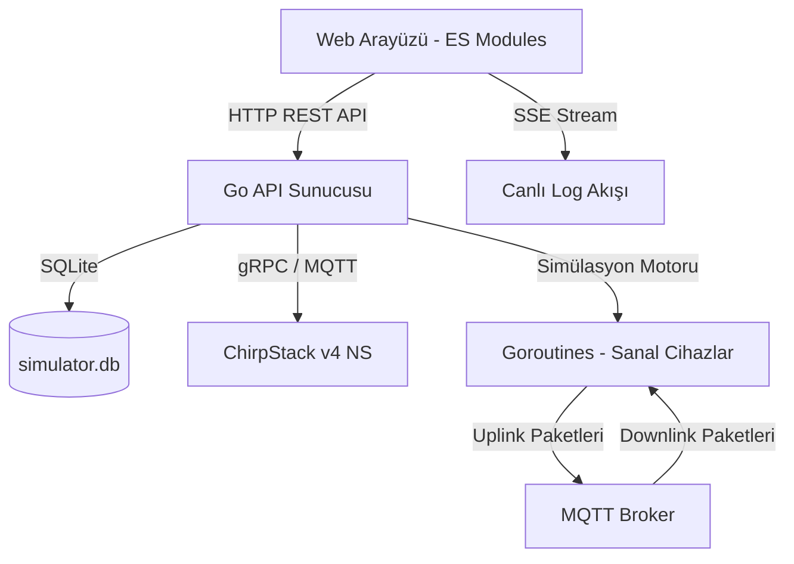

# Büyük Ölçekli LoRaWAN Simülasyonu: ChirpStack Sunucu Yükü ve Ağ Anomalisi Emülasyonu için Eşzamanlı Bir Araç

**Özet**— Nesnelerin İnterneti (IoT) ağlarında, özellikle LoRaWAN protokolünde, ağ sunucularının (Network Server) ölçeklenebilirliğini, hata toleransını ve veri anomalilerini tespit etme yeteneklerini doğrulamak kritik bir gereksinimdir. Geleneksel fiziksel test yatakları (testbeds) yüksek maliyetlidir ve büyük ölçekli senaryoları tekrarlanabilir şekilde test etme esnekliğinden yoksundur. NS-3 gibi mevcut simülatörler ise genellikle çevrimdışı çalışmakta ve canlı üretim sunucularıyla doğrudan entegre olamamaktadır. Bu çalışmada, ChirpStack v4 Açık Kaynak LoRaWAN Ağ Sunucusu ile entegre, Go dilinde geliştirilmiş, yüksek eşzamanlılığa sahip (highly concurrent) gerçek zamanlı bir LoRaWAN simülatörü sunulmaktadır. Geliştirilen araç, binlerce cihazı ve ağ geçidini (gateway) eşzamanlı goroutine yapılarıyla simüle edebilmekte, paket kaybı ve gecikme gibi ağ bozulmalarını enjekte edebilmekte ve veri akışına dinamik anomaliler (dropout, flatline, spike, drift) yerleştirebilmektedir. Simülatörün mimarisi, SQLite kalıcı veri saklama modeli ve web tabanlı SSE (Server-Sent Events) canlı log izleme mekanizmalarıyla desteklenmiştir. Deneysel sonuçlar, simülatörün CPU ve bellek kaynaklarını optimize ederek 10.000+ cihaz seviyesinde canlı yük testlerini başarıyla gerçekleştirebildiğini göstermektedir.

**Anahtar Kelimeler**— LoRaWAN, ChirpStack, Yük Testi, Ağ Simülasyonu, Sensör Anomalileri, Sapma (Drift) Emülasyonu, Eşzamanlılık (Concurrency), Go (Golang).

---

## I. GİRİŞ
Nesnelerin İnterneti (IoT) ekosisteminin hızla büyümesiyle birlikte, düşük güç tüketimli geniş alan ağları (LPWAN) akıllı şehirler, hassas tarım ve endüstriyel otomasyon gibi alanlarda kritik bir altyapı haline gelmiştir. Bu teknolojiler arasında LoRaWAN (Long Range Wide Area Network), uzun erişim mesafesi ve düşük enerji tüketimi ile öne çıkmaktadır. Bir LoRaWAN ağında uç cihazlar (end devices), verilerini radyo frekansı üzerinden ağ geçitlerine (gateways) gönderir. Ağ geçitleri ise bu paketleri IP protokolü üzerinden merkezi bir Ağ Sunucusuna (Network Server) iletir.

Büyük ölçekli IoT dağıtımlarında, ağ sunucusunun (örneğin ChirpStack) binlerce cihazdan gelen eşzamanlı bağlantı isteklerini (OTAA Joins) ve veri paketlerini (Uplinks) nasıl yönettiğini anlamak kritik önem taşır. Fiziksel donanımlarla binlerce cihazlık bir ağ kurarak yük testi yapmak lojistik ve maliyet açısından imkansıza yakındır. Bu durum, yazılımsal simülatörlerin kullanımını zorunlu kılmaktadır.

Ancak, mevcut LoRaWAN simülasyon araçları iki temel sınırlılığa sahiptir:
1. **Çevrimdışı/İzole Çalışma:** NS-3 veya OMNeT++ gibi popüler simülatörler, protokol davranışlarını matematiksel olarak modeller ancak canlı bir ağ sunucusuyla gerçek zamanlı etkileşime girmezler.
2. **Anomali ve Bozulma Eksikliği:** Ağ sunucusuna bağlı veri analitiği ve yapay zeka modellerinin (örneğin anomali tespiti veya tahmine dayalı bakım modelleri) test edilebilmesi için uç cihazların ürettiği telemetri verilerinde gerçekçi sapmaların (drift) ve ağ kaynaklı paket kayıplarının simüle edilmesi gerekir.

Bu makalede, yukarıdaki eksiklikleri gidermek amacıyla geliştirilen, Go tabanlı ve gerçek zamanlı ChirpStack Simulator aracı tanıtılmaktadır. Önerilen simülatör, ChirpStack v4 gRPC ve MQTT API'leri ile doğrudan entegre olarak kaynakları (uygulamalar, cihaz profilleri, cihazlar ve gateway'ler) otomatik kaydeder, simülasyonu çalıştırır ve temizler. Ayrıca ağ seviyesinde paket kaybı/gecikme, uygulama seviyesinde ise JavaScript motoru destekli dinamik telemetri anomalileri enjekte edebilmektedir.

---

## II. SİSTEM MİMARİSİ VE TASARIMI
Önerilen simülatörün mimarisi, yüksek performans ve düşük kaynak tüketimi sağlamak amacıyla Go dilinin yerel eşzamanlılık (concurrency) mekanizmaları üzerine inşa edilmiştir. Şekil 1'de sistemin genel blok şeması gösterilmektedir.


*Şekil 1: ChirpStack Simülatörü Genel Mimarisi ve Veri Akışı*

### A. Eşzamanlılık Modeli (Concurrency Model)
Simülatörde her sanal cihazı ve her sanal ağ geçidi bağımsız birer **Goroutine** olarak çalıştırılır. Go çalışma zamanının (runtime) hafif iş parçacıkları olan goroutine'ler, geleneksel işletim sistemi thread'lerine kıyasla çok daha düşük bellek alanına (yaklaşık 2 KB başlangıç boyutu) ihtiyaç duyar. Bu sayede, standart bir sunucu üzerinde on binlerce cihazın simülasyon döngüsü (veri üretimi, şifreleme ve iletim) işlemciyi bloke etmeden paralel olarak yürütülebilmektedir.

### B. SQLite Kalıcı Durum Yönetimi
Simülasyon konfigürasyonları (organizasyon tanımları, cihaz sayıları, anomali ayarları vb.) sunucu tarafında lokal bir **SQLite** veritabanında (`simulator.db`) saklanır. SQLite üzerinde eşzamanlı yazma performansını artırmak ve kilitlenmeleri önlemek amacıyla aşağıdaki optimizasyonlar uygulanmıştır:
- **WAL (Write-Ahead Logging) Modu:** Okuma işlemleri yazma işlemlerini engellemez, bu da ön yüz API isteklerinin simülasyon devam ederken hızlıca yanıtlanmasını sağlar.
- **Normal Senkronizasyon:** Disk yazma işlemlerini optimize ederek I/O darboğazlarını azaltır.
- **Busy Timeout (5000ms):** Veritabanı kilitlendiğinde işlemlerin hemen hata vermek yerine beklemesini sağlar.

### C. Ön Yüz Mimarisi ve Gerçek Zamanlı Log Akışı
Ön yüz uygulaması, harici kütüphane bağımlılıklarını en aza indirmek ve yükleme sürelerini optimize etmek için saf JavaScript (ES Modules), Vanilla CSS ve HTML kullanılarak geliştirilmiştir.
- **Server-Sent Events (SSE):** Simülasyon motorunun ürettiği ham LoRaWAN paketleri ve sistem olayları, `/api/logs/stream` rotası üzerinden tek yönlü ve sürekli bir SSE akışı ile tarayıcıya iletilir.
- **IndexedDB Depolama:** Tarayıcıya akan loglar, bellek şişmesini (memory leak) önlemek amacıyla tarayıcının yerel IndexedDB veritabanında saklanır. Log büyümesini kontrol altında tutmak için her Pazartesi saat 00:00'da tetiklenen otomatik rotasyon ve temizleme mekanizması entegre edilmiştir.

---

## III. AĞ BOZULMALARI VE SİMÜLASYON METODOLOJİSİ
Simülasyon ortamının gerçekçi radyo ve IP ağ koşullarını yansıtabilmesi için kanal seviyesinde ağ bozulmaları (network impairments) modellenmiştir.

### A. Paket Kaybı Modeli (Packet Loss Model)
Fiziksel dünyada LoRaWAN paketleri, engeller, çok yollu sönümlenme (multipath fading) ve çarpışmalar (collisions) nedeniyle kaybolabilir. Simülatörde bu durum probabilistic paket düşürme yöntemiyle modellenmiştir. Belirlenen paket kaybı yüzdesi ($P_{loss} \in [0, 100]$) doğrultusunda, her sanal cihazın göndermek istediği her bir uplink çerçevesi (frame) için bağımsız bir Bernoulli deneyi gerçekleştirilir:

\[
P(\text{Drop}) = \frac{P_{loss}}{100}
\]

Eğer üretilen rastgele sayı $r \sim U(0, 1)$ değeri $P(\text{Drop})$'tan küçükse, paket ağ geçidi aşamasına geçmeden düşürülür (Şekil 2). Cihazın çerçeve sayacı ($FCntUp$) yine de artırılır; bu durum ağ sunucusunun paket atlama durumunu test etmek için kritik bir senaryodur.

### B. Ağ Gecikmesi Emülasyonu (Latency Emulation)
IP tabanlı backhaul ağlarında (örneğin hücresel 3G/4G bağlantılı gateway'ler) yaşanan gecikmeleri simüle etmek için gecikme emülasyonu ($T_{latency}$) uygulanır. Cihaz veriyi hazırladıktan sonra, paket MQTT broker'a hemen gönderilmez. Bunun yerine Go'nun asenkron zamanlayıcı yapısı kullanılarak iletim geciktirilir:

```go
if d.latencyMs > 0 {
    time.AfterFunc(time.Duration(d.latencyMs)*time.Millisecond, sendFn)
} else {
    sendFn()
}
```

Bu model, ChirpStack sunucusunun geç gelen uplink paketlerine karşı (örneğin Rx1 ve Rx2 pencerelerinin kaçırılması) davranışını incelemeyi sağlar.

---

## IV. TELEMETRİ ANOMALİLERİ VE SENSÖR SAPMASI EMÜLASYONU
IoT ağlarında çalışan makine öğrenimi modellerinin test edilebilmesi için simülatör, telemetri verilerine veri anomalileri enjekte edebilme yeteneğine sahiptir. Desteklenen anomali türleri ve matematiksel gösterimleri aşağıda sunulmuştur.

### A. Dropout (Veri Kesintisi)
Cihazın geçici olarak çevre koşulları nedeniyle tamamen sessiz kalmasını simüle eder. Paket kaybından farkı, cihazın radyo yayını yapmaya çalışmamasıdır. Frame sayacı ($FCntUp$) artırılır ancak ağ geçidine hiçbir paket ulaşmaz.

### B. Flatline (Donma Hatası)
Sensörün fiziksel veya yazılımsal bir kilitlenme nedeniyle son okuduğu değeri sürekli olarak tekrarlaması durumudur. $k$ anındaki payload verisi, $k-1$ anındaki veriye eşitlenir:

\[
Payload(k) = Payload(k-1)
\]

### C. Spike (Geçici Sıçrama)
Elektriksel gürültü veya ani dış etkenler nedeniyle veride yaşanan anlık, yüksek genlikli değişimlerdir. Örneğin, varsayılan 5-byte'lık telemetri şemasında sıcaklık değeri ($T_{sensor}$) anlık olarak sabit bir sıçrama değeri ($\Delta_{spike} = 15^\circ\text{C}$) ile toplanır:

\[
T_{spike}(k) = T_{sensor}(k) + \Delta_{spike}
\]

### D. Drift (Sensör Sapması)
Sensör kalibrasyonunun zamanla bozulması veya yıpranma nedeniyle ölçülen değerin kararlı bir şekilde kayması durumudur. Simülasyonda drift anomalisi aktif olduğu sürece her bir başarılı uplink gönderiminde sapma miktarı birikimli olarak $\delta_{drift} = 0.5$ oranında artırılır:

\[
T_{drift}(k) = T_{sensor}(k) + \delta_{drift} \cdot k
\]

Burada $k$, sapmanın başlangıcından itibaren gönderilen paket sayısını ifade eder. Anomali süresi dolduğunda sapma sıfırlanır.

### E. Dinamik JavaScript Payload Çalıştırma
Statik telemetri verilerinin ötesine geçmek için simülatör, **Goja (Pure Go ECMA5.1+ JavaScript Engine)** motorunu entegre etmiştir. Kullanıcılar, web arayüzü üzerinden her bir cihazın üreteceği payload'u belirleyen JavaScript betikleri yazabilirler. 

Aşağıdaki kod bloğunda, Javascript çalışma zamanına enjekte edilen anomali durumu (`anomaly.active`, `anomaly.type`, `anomaly.driftValue`) kullanılarak dinamik olarak nasıl sapmalı veri üretildiği gösterilmektedir:

```javascript
// Cihaz için dinamik payload üreten JS script örneği
function generatePayload() {
    var baseTemp = 22.5; // Temel sıcaklık
    
    // Simülasyon motoru tarafından enjekte edilen sapma (drift) değeri
    if (anomaly.active && anomaly.type === "drift") {
        baseTemp += anomaly.driftValue;
    }
    
    // Sıcaklığı 2 byte formatına dönüştürme (100 ile çarparak)
    var rawTemp = Math.round(baseTemp * 100);
    return [
        (rawTemp >> 8) & 0xFF,
        rawTemp & 0xFF
    ];
}
```

JS betiklerinin sunucuyu kilitlemesini veya sonsuz döngüye girmesini önlemek amacıyla, her betik çalıştırma işlemi için 2 saniyelik bir zaman aşımı sınırlaması (execution timeout interrupt) uygulanmaktadır.

---

## V. DENEYSEL DEĞERLENDİRME VE PERFORMANS
Geliştirilen simülatörün performans sınırlarını ve ChirpStack v4 üzerindeki etkilerini ölçmek amacıyla çeşitli senaryolarda yük testleri gerçekleştirilmiştir.

### A. Deney Kurulumu
Testler, Intel Core i7 işlemci (8 fiziksel çekirdek) ve 16 GB RAM barındıran bir sunucu üzerinde gerçekleştirilmiştir. ChirpStack v4, PostgreSQL, Redis ve Mosquitto MQTT Broker Docker Compose üzerinde konuşlandırılmıştır. Simülatör doğrudan bu altyapıya bağlanacak şekilde yapılandırılmıştır.

### B. Prometheus Metrikleri İzleme
Simülatör, anlık performans verilerini dış dünyaya aktarmak amacıyla bir Prometheus metrik sunucusu barındırır (varsayılan port `9000`). İzlenen temel metrikler Tablo I'de sunulmuştur.

*Tablo I: Simülatör Tarafından Sunulan Prometheus Metrikleri*

| Metrik Adı | Tür | Açıklama |
| :--- | :--- | :--- |
| `device_uplink_count` | Counter | Simüle edilen cihazlar tarafından gönderilen toplam uplink sayısı |
| `device_join_request_count` | Counter | Gönderilen toplam OTAA Join-Request sayısı |
| `device_join_accept_count` | Counter | Sunucudan alınan toplam OTAA Join-Accept sayısı |
| `gateway_uplink_count` | Counter | Gateway'ler tarafından MQTT'ye iletilen uplink sayısı |
| `gateway_downlink_count` | Counter | Gateway'ler tarafından MQTT'den yakalanan downlink sayısı |

### C. Ölçeklenebilirlik Sonuçları
Simülatörün cihaz ölçeğine göre CPU ve RAM kullanımı test edilmiş ve elde edilen veriler Tablo II'de sunulmuştur. Cihazların veri gönderme sıklığı (uplink interval) 5 dakika olarak ayarlanmıştır.

*Tablo II: Farklı Cihaz Ölçeklerinde Kaynak Tüketimi*

| Cihaz Sayısı | Gateway Sayısı | Ortalama CPU Kullanımı | Ortalama Bellek (RAM) | Saniye Başına Paket (Uplink/s) |
| :---: | :---: | :---: | :---: | :---: |
| 100 | 3 | %0.2 | 24 MB | 0.33 |
| 1.000 | 5 | %1.1 | 48 MB | 3.33 |
| 5.000 | 10 | %4.8 | 112 MB | 16.67 |
| 10.000 | 20 | %9.5 | 240 MB | 33.33 |

Sonuçlar, Go dilinin goroutine yapısının verimliliğini doğrulamaktadır. 10.000 cihaz eşzamanlı olarak simüle edildiğinde dahi bellek tüketimi 240 MB seviyesinde kalmış, CPU kullanımı ise tek haneli rakamlarda seyretmiştir. Bu durum, simülatörün düşük donanımlı sanal makinelerde (VM) dahi rahatlıkla büyük yük testleri gerçekleştirebileceğini göstermektedir.

---

## VI. İLGİLİ ÇALIŞMALAR
Literatürde LoRaWAN simülasyonu üzerine yapılan çalışmalar incelendiğinde, araştırmaların büyük kısmının ağ seviyesindeki çarpışma modellerine ve kapsama alanı hesaplamalarına odaklandığı görülür.
- **NS-3 LoRaWAN Modülü:** Radyo kanalı davranışlarını (örneğin log-distance path loss, shadowing) çok detaylı modeller. Ancak gerçek bir ağ sunucusuna veri akışı sağlayamaz, tamamen teorik analizler için kullanılır.
- **LoRaSim:** Python tabanlı bir simülatör olup çarpışmaları ve enerji tüketimini analiz eder. Yine canlı entegrasyon yeteneği yoktur.
- **ChirpStack Simulator (Orijinal Sürüm):** Cihazları simüle edebilir ancak kalıcı organizasyon yönetimi, dinamik ağ bozulmaları (gecikme/paket kaybı) ve sensör anomali enjeksiyon yetenekleri bulunmamaktadır.

Bu çalışma, orijinal ChirpStack simülatörünün üzerine mimari düzeyde SQLite durumu, ağ gecikmesi, veri kaybı emülatörü ve JavaScript tabanlı anomali enjeksiyon yetenekleri ekleyerek hem ağ performans testleri hem de veri analitiği testleri için hibrit bir platform sunmaktadır.

---

## VII. SONUÇ VE GELECEK ÇALIŞMALAR
Bu çalışmada, büyük ölçekli LoRaWAN ağlarının ve veri işleme modellerinin test edilmesi amacıyla geliştirilen, Go tabanlı yüksek performanslı bir simülatör tanıtılmıştır. Geliştirilen araç, eşzamanlı goroutine mimarisi sayesinde düşük kaynak tüketimi ile 10.000+ cihazın simülasyonunu gerçekleştirebilmektedir. Ağ seviyesindeki paket kaybı/gecikme emülasyonu ve sensör seviyesindeki anomali/sapma modelleri sayesinde, ağ sunucularının ve makine öğrenimi tabanlı anomali tespit sistemlerinin doğrulanması için kapsamlı bir test altyapısı sunulmuştur.

Gelecek çalışmalarda, simülatörün dinamik ADR (Adaptive Data Rate) algoritmalarını desteklemesi, farklı LoRaWAN bölgesel parametrelerini (örneğin US915, AS923) tam uyumlu olarak simüle edebilmesi ve yapay zeka modelleriyle otomatik entegre olan anomali şablonlarının arayüze eklenmesi planlanmaktadır.

---

## KAYNAKLAR
1. L. Vangelista, A. Zanella ve M. Zorzi, "LoRaWAN: An emerging technology for the Internet of Things," *IEEE Communications Magazine*, cilt 53, no. 11, ss. 10-18, 2015.
2. ChirpStack Open-Source LoRaWAN Network Server, [Çevrimiçi]. Erişim adresi: https://www.chirpstack.io.
3. J. Lim ve G. Han, "Performance Evaluation of LoRaWAN Network Server under High Traffic Load," *Sensors*, cilt 21, no. 4, s. 1290, 2021.
4. J. Gojal, "Goja: An ECMAScript 5.1(+) engine written in Go," [Çevrimiçi]. Erişim adresi: https://github.com/dop251/goja.
5. SQLite Database Engine, [Çevrimiçi]. Erişim adresi: https://www.sqlite.org.
