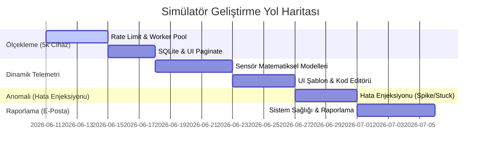

# 📋 ChirpStack Simülatörü — Ölçeklenebilirlik, Dinamik Telemetri ve Anomali Simülasyonu Yol Haritası (TODO)

Bu yol haritası, simülatörün **5.000 cihaz ölçeğine çıkarılması**, **zamanla değişen gerçekçi telemetri verisi üretmesi** ve **anormal durumların (anomali) simülasyonu ile tespiti** için yapılacak adımları ve mimari planı içerir.

---

## 🟢 AŞAMA 1: ÖLÇEKLENEBİLİRLİK VE PERFORMANS (5.000 Cihaz Desteği)

5.000 cihazın aynı anda simüle edilmesi Go tarafında hafif goroutine'ler sayesinde kolay olsa da, ChirpStack API limitleri, MQTT ağ trafiği ve tarayıcı arayüzünün (UI) bu veriyi işlemesi sırasında darboğazlar oluşabilir.

### 1. Provisioning ve Aktivasyon Darboğazlarının Giderilmesi
- [x] **Worker Pool (İşçi Havuzu) ile Kayıt:** Cihazların ChirpStack API'sine kaydedilmesi (`CreateDevice`) ve OTAA aktivasyon isteklerinin (`JoinRequest`) toplu halde gönderilmesi yerine saniyede N adet olacak şekilde rate-limit (hız sınırlayıcı) eklenmesi.
- [ ] **Aşamalı Aktivasyon Gecikmesi (`otaaDelay`):** 5.000 cihazın aynı anda `JoinRequest` atıp MQTT broker'ı ve ChirpStack'i kilitlemesini önlemek için aktivasyon sürelerinin zamana yayılması (örn: `activation_time` parametresinin 5 dakikaya yayılarak rastgele dağıtılması).
- [ ] **MQTT Bağlantı Yönetimi:** Gateway'lerin MQTT broker ile olan bağlantılarının (özellikle MQTT paket yazma kuyrukları) optimize edilmesi ve yazma buffer boyutlarının artırılması.

### 2. SQLite ve API Performansı
- [x] **SQLite Concurrency (Eşzamanlılık):** Simülatör çalışırken veritabanı yazma kilitlerini engellemek için SQLite'ın `WAL (Write-Ahead Logging)` moduna alınması.
- [x] **Sayfalama (Pagination) ve Arama:** Arayüzün 5.000 cihazı tek seferde render edip kasmaması için `Devices` ve `Device Intervals` tablolarının backend tarafında gerçek SQL `LIMIT` / `OFFSET` ile sayfalanması (frontend filtreleme yerine backend filtreleme).

### 3. Frontend & WebSocket Optimizasyonu
- [ ] **WebSocket Debouncing:** 5.000 cihaz saniyede bir veri gönderdiğinde WebSocket üzerinden arayüze akan log trafiğinin debouncing/throttling ile azaltılması (örn: logların tarayıcıya 500ms'lik paketler halinde toplu gönderilmesi).
- [ ] **Harita Render Sınırı:** Haritada 5.000 cihazın tamamının çizilmesi yerine sadece aktif/sinyal gönderen cihazların gösterilmesi veya `Leaflet.markercluster` kütüphanesi entegre edilerek harita performansının korunması.

---

## 🟡 AŞAMA 2: ZAMANLA DEĞİŞEN DİNAMİK TELEMETRİ SİMÜLASYONU

Cihazların gerçekçi testler sunabilmesi için statik payload'lar yerine zaman serisi halinde değişen fiziksel sensör verileri (Sıcaklık, Nem, Basınç, Batarya vb.) üretilmelidir.

### 1. Matematiksel Modellerle Telemetri Üretimi
Simülatörün Go backend tarafındaki JavaScript motoru (`goja`) entegrasyonu tamamlanmıştır ve çalışmaktadır:
- [x] **Goja JS Engine Entegrasyonu (Tamamlandı):** Go backend tarafında JavaScript betikleri çalıştırılarak dinamik veri üretimi gerçekleştirilmektedir.
- [ ] **Rastgele Yürüyüş (Random Walk):** Sensörün bir önceki değere bağlı olarak hafifçe artıp azalması (örn: oda sıcaklığı).
- [ ] **Periyodik Dalgalanma (Sine/Cosine):** Gece-gündüz sıcaklık değişimleri veya periyodik çalışan makinelerin titreşim modelleri.
- [ ] **Doğrusal Aşınma/Eğilim (Linear Drift):** Pil seviyesinin yavaşça tükenmesi veya filtre kirliliği gibi sürekli artan/azalan değerler.

### 2. UI / Config Entegrasyonu
- [x] **UI Payload Editor (Tamamlandı):** Çekmece (Drawer) içine dinamik veri üretim formülü yazılabilen "Dinamik Payload Betiği" editörü eklendi.
- [ ] **Önceden Tanımlı Şablonlar (Templates):** Arayüzde tek tıkla seçilebilen şablon formüller (Sıcaklık, Su Sayacı vb.) eklenmesi.

---

## 🔵 AŞAMA 3: ANOMALİ SİMÜLASYONU (Hata Enjeksiyonu)

Anormal durum tespiti algoritmalarını (kural motorları, makine öğrenmesi modelleri) test edebilmek için simülatörün bilerek hatalı/anormal veriler üretmesi sağlanmalıdır.

### 1. Anomali Türlerinin Tanımlanması
- [x] **Ani Sıçrama (Spike/Surge):** Veride ani ve çok yüksek bir yükseliş/düşüş meydana gelmesi (örn: yangın esnasında sıcaklığın bir anda 80°C'ye çıkması).
- [x] **Donma / Durgunluk (Stuck/Flatline):** Sensörün sürekli aynı değeri üretmesi (fiziksel olarak donmuş sensör hatası).
- [x] **Veri Kaybı / Kesinti (Dropout):** Belirli zaman aralıklarında sensörün hiç veri göndermemesi veya geçersiz değer göndermesi (`null`, `0` vb.).
- [x] **Sapma / Hızlı Aşınma (Drift):** Sensör kalibrasyonunun bozularak değerlerin sürekli yukarı veya aşağı doğru kayması.

### 2. Anomali Tetikleme Mekanizmaları
- [x] **Manuel Tetikleme (On-Demand):** Web arayüzündeki cihaz listesinden bir cihaza tıklayıp *"Anomali Enjekte Et (Sıcaklık Spike)"* butonu ile anlık tetikleme.
- [x] **Planlanmış/Olasılıksal Tetikleme (Probabilistic):** Config üzerinden her cihazın %1 olasılıkla gün içinde anomali yaşaması seçeneği.

---

## 🔵 AŞAMA 4: SİSTEM SAĞLIĞI VE E-POSTA RAPORLAMA (System Health & Email)

Simülatörün sağlık durumunu ve çalışma istatistiklerini günlük olarak e-posta ile raporlama altyapısının kurulması. Ubuntu VM sunucu dağıtımı göz önünde bulundurularak ağ ve güvenlik duvarı (port engelleri) test yeteneklerini içerecektir.

### 1. SMTP Konfigürasyonu & Güvenlik
- [ ] **SMTP Config Tanımları:** `simulator.toml` ve Docker (`docker-compose.yml`) çevre değişkenleri üzerinden Host, Port, Kullanıcı, Şifre ve TLS/SSL ayarlarının güvenli bir şekilde alınması.
- [ ] **Alıcı/Gönderici Ayarları:** Raporların gönderileceği hedef e-posta adresi (`report_email`) ve gönderici e-posta ayarlarının tanımlanması.

### 2. Metrik Toplama & Zamanlayıcı
- [ ] **İstatistik Servisi:** SQLite ve bellek üzerinden günlük metriklerin (aktif simüle edilen cihaz sayısı, toplam gönderimler, hata/anomali oranları) derlenmesi.
- [ ] **Daily Cron Ticker:** Go backend tarafında her 24 saatte bir tetiklenecek arka plan zamanlayıcısının entegrasyonu.

### 3. Raporlama Arayüzü & Test Modülü (Ubuntu VM Odaklı)
- [ ] **HTML Rapor Şablonu:** Derlenen metrikleri gösteren şık, modern ve mobil uyumlu bir HTML e-posta şablonunun oluşturulması.
- [ ] **E-Posta Test Butonu & API:** Ubuntu VM üzerinde SMTP port erişimlerini (örn: UFW firewall engelleri, port 587/465/25 blokajları) anında test edebilmek için arayüze bir "Test E-postası Gönder" butonu eklenmesi ve `/api/system/test-email` API endpoint'inin yazılması.

---

## 📌 ÖNCELİKLİ ADIMLAR VE YOL HARİTASI

> [!TIP]
> **Öncelikli Başlangıç Noktası:** 5.000 cihaz simülasyonunu başlatabilmek için öncelikle **ChirpStack API kayıt hız sınırlayıcısını (rate-limiter)** backend tarafında hayata geçirmek en kritik ilk adımdır. Aksi takdirde ChirpStack gRPC API'si aşırı yükten dolayı hata verecektir.
