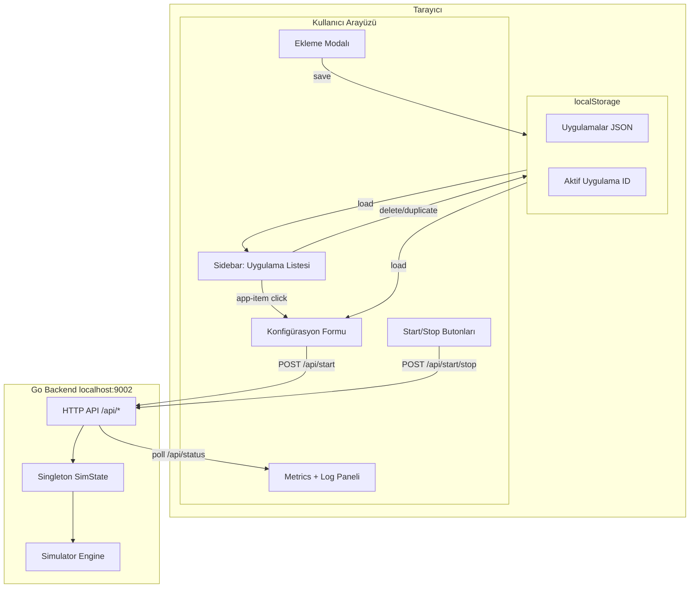

# UI Redesign: Sidebar + Multi-App Management

## Mevcut Durum
- Backend singleton `SimState` — aynı anda sadece **1 simülasyon** çalışabilir
- UI tek formlu, tek sayfalı, çoklu uygulama yok
- "Uygulama" = bir konfigürasyon profili (ayarlar şablonu)

## Hedef
- Sol tarafta **sidebar menü** → kaydedilmiş uygulamalar listelenir
- **'+' butonu** → yeni uygulama eklemek için modal açar
- Sağ tarafta **detay/kontrol paneli** → seçili uygulamanın formu, start/stop, metrikler

## Veri Akışı
```
┌─────────────────────────────────────────────────────┐
│  Tarayıcı (localStorage)                             │
│  ┌──────────┐  ┌──────────┐  ┌──────────┐          │
│  │ Uyg-1    │  │ Uyg-2    │  │ Uyg-3    │  ...      │
│  │ (tenant) │  │ (tenant) │  │ (tenant) │          │
│  │ device=5 │  │ device=10│  │ device=3 │          │
│  └──────────┘  └──────────┘  └──────────┘          │
│         │                                            │
│         ▼ Seçilen uygulama formu doldurulur          │
│         ▼ POST /api/start (seçili config ile)        │
│         ▼ Status/Metrics poll                         │
└─────────────────────────────────────────────────────┘
```

## Yeni HTML Yapısı

```
.app
├── .sidebar                          ← SOL: 240px genişlik
│   ├── .sidebar-header
│   │   ├── Logo "📡 ChirpStack"
│   │   └── .badge (connection)
│   ├── .sidebar-actions
│   │   └── button#btn-add-app "+ Yeni Uygulama"
│   ├── .app-list                     ← Uygulama kartları
│   │   └── .app-item (seçili olan active)
│   │       ├── .app-item-icon
│   │       ├── .app-item-info
│   │       │   ├── .app-item-name
│   │       │   └── .app-item-meta
│   │       └── .app-item-actions (sil/çiftle)
│   └── .sidebar-footer
│       └── version + durum
│
├── .main-content                    ← SAĞ: flex-1
│   ├── .top-bar
│   │   ├── .top-bar-left (seçili uygulama adı)
│   │   └── .top-bar-right
│   │       ├── .status-badge
│   │       └── .uptime-badge
│   ├── .stats-row (4 kart)
│   ├── .content-grid
│   │   ├── .config-panel (form, start/stop)
│   │   └── .right-column
│   │       ├── .metrics-panel
│   │       └── .log-panel
│   └── .toast
```

## Modal Yapısı (Yeni Uygulama Ekleme)

```
.modal-overlay
└── .modal
    ├── .modal-header
    │   └── "Yeni Uygulama Ekle"
    ├── .modal-body
    │   └── form alanları (ad + tenant_id zorunlu)
    └── .modal-footer
        ├── .btn İptal
        └── .btn Kaydet
```

## CSS Değişiklikleri

| Bileşen | Detay |
|---------|-------|
| `.sidebar` | Sabit 240px, `flex-shrink:0`, sağ border, koyu arkaplan |
| `.app-list` | Scrollable, `max-height: calc(100vh - 180px)` |
| `.app-item` | 8px padding, hover/active efekt, border-radius |
| `.app-item-actions` | `opacity:0` → hover'da görünür |
| `.main-content` | `flex:1; overflow-y:auto; padding:20px` |
| `.modal-overlay` | Fixed, semi-transparent, backdrop |
| `.modal` | 480px max-width, card görünümü |
| `.top-bar` | Flex row, badge + app name |
| Responsive | <768px: sidebar `position:fixed` slide-in/out hamburger |

## JS Değişiklikleri (app.js)

### Yeni Veri Yapısı
```js
// localStorage'da saklanan uygulamalar
var apps = [
    {
        id: "uuid",
        name: "Test",
        config: {
            tenant_id: "...",
            device_count: 5,
            gateway_count: 2,
            // ... tüm StartRequest alanları
        }
    }
];
```

### Yeni Fonksiyonlar
| Fonksiyon | Açıklama |
|-----------|----------|
| `loadApps()` | localStorage'dan uygulamaları yükle |
| `saveApps()` | Uygulamaları localStorage'a kaydet |
| `renderAppList()` | Sidebar'daki liste UI'ını güncelle |
| `selectApp(id)` | Seçili uygulamayı aktif yap, formu doldur |
| `addApp(name, config)` | Yeni uygulama ekle, listeye ekle |
| `deleteApp(id)` | Uygulamayı sil |
| `duplicateApp(id)` | Uygulamayı kopyala |
| `showAddModal()` | Modal'ı aç |
| `hideAddModal()` | Modal'ı kapa |
| `loadAppIntoForm(app)` | Seçili uygulamanın config'ini form alanlarına yükle |
| `collectConfig()` | Mevcut — aynen kalır (form → API'ye gönder) |
| `setActiveAppId(id)` | Hangi uygulamanın active olduğunu işaretle |

### Değişen Fonksiyonlar
- `init()` → Önce `loadApps()`, eğer boşsa default uygulama oluştur, sonra `renderAppList()` + `selectApp(ilk)`
- `startSimulation()` → Start'tan önce formdaki config'i şu an seçili uygulamaya **kaydet** (`saveApps()`)

### Dokunulmayan Fonksiyonlar
- `api()` — aynen kalır
- `log()` — aynen kalır
- `showToast()` — aynen kalır
- `setStatusBadge()` — aynen kalır
- `formatUptime()` — aynen kalır
- `checkHealth()` — aynen kalır
- `pollStatus()` → sadece stat tenant/devices/gateways/inverval için mevcut uygulama adını da göster
- `stopSimulation()` — aynen kalır

## Backend Değişiklik GEREKMEZ
- `api.New()` → New zaten `uiHandler()`'ı root'a bağlıyor
- Sadece frontend dosyaları (`index.html`, `style.css`, `app.js`) değişecek
- `server.go`'daki `Handler` field (test için eklenmişti) isteğe bağlı — geri alınabilir

## Adımlar (Uygulama Sırası)

1. `index.html` — Sidebar + Modal HTML yapısını yaz (mevcut form içeriğini sidebar dışına taşı)
2. `style.css` — Sidebar, modal, responsive stillerini ekle (mevcut stilleri koru)
3. `app.js` — Uygulama yönetimi, sidebar listeleme, modal kontrollerini ekle
4. `server.go` — Eğer `Handler` field'ı sonra geri alınacaksa bu adımda yap (şimdilik kalsın)
5. Docker build + UI doğrulama
6. Sidebar'da uygulama listesi, yeni ekleme, silme ve başlatma akışını test et

## Mermaid Diagram: Bileşen Akışı


